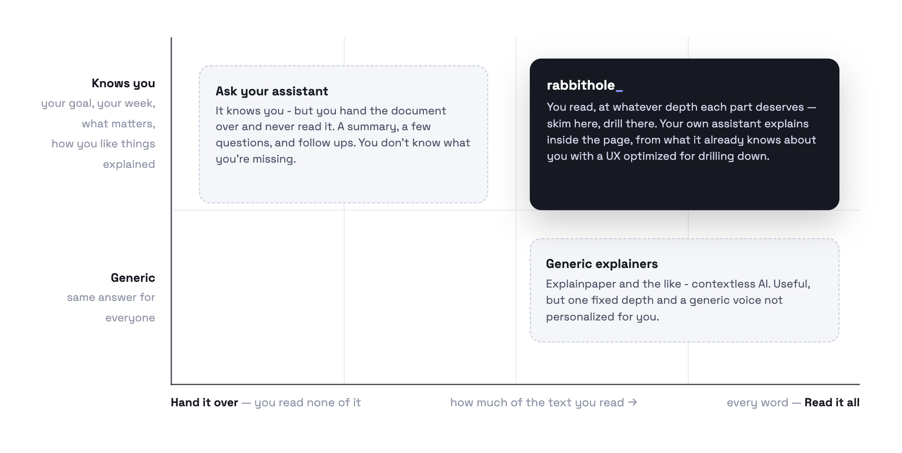

# RabbitHole

Dense documents are hard to read, even in your own field. Research papers, articles, lab results, tax forms, unfamiliar code. Rabbithole lets you zoom in on the parts you don't understand and the explaining is done by your personal assistant aware about your context.

## Where RabbitHole fits

If we divide reading into two axes -
- x axis - the granularity you read the text in - from "hand it over for a summary" to "every word"
- y axis - the amount of personalized help you have while reading(could be human but let's focus on AI here)

RabbitHole sits on top right. It's immensely useful for cases where you want to actually read, understand or skim over a piece, than only working with a derivative of the original text(summaries or questions asked on top).

## Inspiration

I read a lot - articles, papers, code, engineering spec, wiki pages and so much more. And I love going down rabbit holes, which there are many of when I'm reading dense documents or text in domains I'm not proficient in. So very often, I start at something, have a dozen open tabs a few hours later plus a long thread with an AI, and have lost track of whatever I was reading in the first place. I wanted to fix this workflow.You know how fun it is to read and figure something out with a smarter friend who also knows your gaps? Everything gets so much easier. Well, that's the experience I wanted to create.

I'm also trying to imagine a future where web feels more collaborative, where you and your agent do things together, like partners. As agents become more personal, I don't just want them to be doing things *for* me on some remote cloud machine. I want them to be ambiently present *with* me, across every surface.

The design inspiration is https://notes.andymatuschak.org.

## What it does

- True to its name, it lets you go as deep as you want into anything, starting from something you want to read and understand.
- There is a nice sliding pane UI(Andy Matuschak's style).
- You start with pasting the text or link for what you want to read and asking your agent to help you with reading alongside. 
- Your personal agent(codex, claude, openclaw, hermes, littlebird, anything that supports WebMCP) highlights the terms and parts that are non trivial "for you".  A biologist probably doesn't know "apophenia"; a psychologist probably doesn't know "Cas9". So whatever terms are likely unfamiliar to you gets highlighted.
- But you're not limited to them, you can also pick anything else or even multiple sentences, and drill into that.
- Everything you drill into opens a pane on the right. From there you can keep elaborating on that thing, or go deeper into something else and open more panes.
- Every explanation, elaboration, and answer takes into account both the context it sits in and *you* — your goals, your familiarity with the concepts, other things you've been doing that might connect.
- You can set an explicit goal for why you're reading. Maybe you're reading papers on homeschooling to decide the best course for your child, or researching vocal technique to sing better. Knowing the goal, on top of everything else about your life, lets the agent explain things even better.
- It stores the concepts you drilled into so they're easy to revisit.
- Once you have it in your agent's memory, you can also just ask it - "open this thing in RabbitHole".
